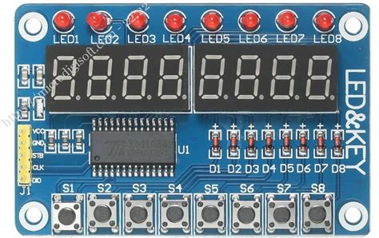
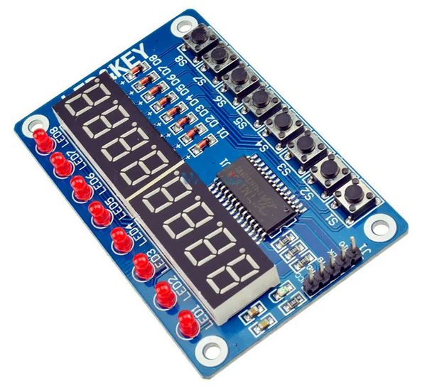
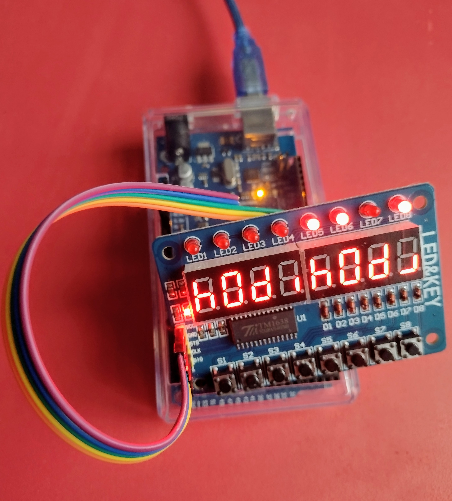

# [easiTM1638 Arduino Library](https://github.com/ilneill/easiTM1638)

This is a very simple Arduino Library to control the TM1638 (up to) 8-digit (+ decimal points) 7-segment LED display driver. Additionally, this library also supports up to 8 LEDs and 8 buttons, as found on the readily available "LED&KEY" TM1638 based module.

The TM1638 is a small IC that can control up to eight 7-segment LED display digits, each with an individually controllable decimal point. It also has a keyboard scan interface, and that feature is supported by this library for up to 8 buttons. Additionally, using extra "segment" control pins, this library supports up to 8 individully controllable LEDs. The TM1638 uses a 3-wire serial interface that appears similar to, but is simpler than, the SPI bus.

## Why... Why Indeed?

Another project I am working on (A Kim-1 Mega Emulator) has a lot of rabbit holes that I am compelled to go down.

One such rabbit hole is trying and testing libraries and hardware for some keypad input and LED/LCD output. I am mostly testing on an Arduino Mini Pro (it was what I had to hand), but I am also using an Arduino Mega (it was beside the Mini Pro). After a lot of research, none of the existing TM1638 libraries were ticking all the boxes for what I wanted to achieve, and how I wanted to achieve it. So, I decided to write my own library for the TM1638, doing exactly what I wanted, how I wanted it to be done, keeping it simple and without any unnecessary "features".

So far, the "LED&KEY" TM1638 based module has easily been my favourite, and I am likely going to use it in my Kim-1 Mega Emulator project.

## Contents

1. [Library Features](https://github.com/ilneill/easiTM1638/#library-features)
2. [Library Installation](https://github.com/ilneill/easiTM1638/#library-installation)
3. [API Details](https://github.com/ilneill/easiTM1638/#api-details)
4. [TM1638 Chip Pinout](https://github.com/ilneill/easiTM1638/#TM1638-chip-pinout)
5. [A Common TM1638 Module](https://github.com/ilneill/easiTM1638/#a-common-TM1638-module)
6. [Example Hardware Build](https://github.com/ilneill/easiTM1638/#example-hardware-build)
7. [ToDo](https://github.com/ilneill/easiTM1638/#todo)
8. [References](https://github.com/ilneill/easiTM1638/#references)

## Library Features

This library uses Arduino shiftIn/shiftOut functions for the serial communication protocol and implements several higher functions built on one that simply write bytes to the TM1638 device.

* Supports 7-Segment LED displays of up to 8 digits (+dps) using the TM1638.
* Supports up to 8 LEDs and 8 buttons, as found on the "LED&KEY" TM1638 based module.
* Uses only the fixed addressing modes of the TM1638 chip.
* Has functions to easily display defined characters and 8, 12 and 16 bit numbers in decimal or hex digits.
* Has functions to easily write to the LEDs and read the buttons of the "LED&KEY" TM1638 based module.

## Library Installation

Currently the best (only) way you can install this library into your Arduino environment is manually from this repository.  

### Installing via this Repository 

First, you have to [download](https://github.com/ilneill/easiTM1638/archive/refs/heads/main.zip) this library in zip format. 

Then, unzip the easiTM1638-main.zip file into your Arduino Library folder. 

* On __Windows__: Documents\Arduino\libraries
* On __MAC OS__: ˜/Documents/Arduino/libraries
* On __Linux__: ˜/Documents/Arduino/libraries

## API Details

### Class definition:
__TM1638(uint8_t stbPin = 4, uint8_t clkPin = 2, uint8_t dataPin = 3);__
* Create a TM1638 instance.

### Functions:

__void begin(uint8_t numButtons = 8, uint8_t numLEDs = 8, uint8_t numDigits = 0, uint8_t brightness = 2);__
* Set up the display and initialise it with starting values. The default DigitMap is assumed. Returns nothing.

__void begin(uint8_t* tmDigitMap, uint8_t numLEDs = 8, uint8_t numDigits = 0, uint8_t brightness = 2);__
* Set up the display and initialise it with starting values. The passed DigitMap is used. Returns nothing.

__void displayOff(void);__
* Turn the TM1638 display OFF. Returns nothing.

__void displayClear(void);__
* Clear all the LEDs and digits (+dps) in the display. Returns nothing.

__void displayBrightness(uint8_t brightness = 2);__
* Set the brightness (0x00 - 0x07) and turn the TM1638 display ON. Returns nothing.

__void displayBin8(uint8_t number, bool lsbFirst = false);__
* Display a binary integer between 0b00000000 - 0b11111111, starting at digit 0 for the LSB or MSB. Returns nothing.

__void displayChar(uint8_t digit, uint8_t number, bool raw  = false);__
* Display a character in a specific LED digit. Returns nothing.

__void displayInt8(uint8_t digit, uint8_t number, bool useDec = true);__
* Display a decimal integer between 0 - 99, or a hex integer between 0x00 - 0xff, starting at a specific digit. Returns nothing.

__void displayInt12(uint8_t digit, uint16_t number, bool useDec = true);__
* Display a decimal integer between 0 - 999, or a hex integer between 0x000 - 0xfff, starting at a specific digit. Returns nothing.

__void displayInt16(uint8_t digit, uint16_t number, bool useDec = true);__
* Display a decimal integer between 0 - 9999, or a hex integer between 0x0000 - 0xffff, starting at a specific digit. Returns nothing.

__void displayLED8(uint8_t number, bool lsbFirst = false);__
* Display a binary integer between 0b00000000 - 0b11111111 on the LEDs, starting at LED 0 (LHS) for the LSB or MSB. Returns nothing.

__void displayLED1(uint8_t digit, bool status = OFF);__
* Turn ON/OFF the LED at a specific position, 0 -> 7 : Left -> Right. Returns nothing.

__void displayDP(uint8_t digit, bool status = false);__
* Turn ON/OFF the decimal point for the specified digit. Returns nothing.

__uint8_t readButtons(void);__
* Read all the buttons into a single byte. Returns an unsigned byte containing the UP(=1)/DOWN(=0) status of each button.

### TM1638 Addressing Modes
The TM1638 uses addresses and enable lines (GRID1-GRID8) to uniquely identify and access each of the 7-Segment LED display digits.

* Logical digit 0 = Address 0x00
* Logical digit 1 = Address 0x02
* Logical digit 2 = Address 0x04
* Logical digit 3 = Address 0x06
* Logical digit 4 = Address 0x08
* Logical digit 5 = Address 0x0A
* Logical digit 6 = Address 0x0C
* Logical digit 7 = Address 0x0E

The TM1638 chip supports 2 addressing modes but only the fixed address mode is used by the library.

#### Fixed
Only this addressing mode is used because the TM1638 digit addressing is not in incrementing sequential order.

In this mode, the address to be used by the TM1638 for accessing each digit must be specified, before each digit write, to point to the digit that is to be written to.

### TM1638 Logical to Physical Address Mapping
As alluded to earlier, the TM1638 uses addresses for each 7-Segment LED display digit.

In this library I have assumed that the lefthand digit is logical digit 0, and the righthand digit is logical digit 7. However, it may be that the physical layout of the digits, left to right is not in the same increasing order as the logical addressing.

For instance, if the physical layout is such that logical digit 0, addressed by 0x00, is the righthand digit, and logical digit 7, addressed by 0x0E, is the lefthand digit, then, without some translation, this library will actually display everything backwards. 

i.e. Trying to display "h1234567" would actually look like "7654321h" on such a display.

It might be that the logical and physical layouts are not simply reversed. Before writing this library I discovered that my 6-digit TM1637 display had a reversed physical layout for each of the 3-digit blocks making up the 6 digits.

Physical digits = | 0 || 1 || 2 || 3 || 4 || 5 |

Logical digit 0 = Address 0x00 -> Physical digit 2\
Logical digit 1 = Address 0x01 -> Physical digit 1\
Logical digit 2 = Address 0x02 -> Physical digit 0\
Logical digit 3 = Address 0x03 -> Physical digit 5\
Logical digit 4 = Address 0x04 -> Physical digit 4\
Logical digit 5 = Address 0x05 -> Physical digit 3

To overcome this absurdity, I created a logical to physical mapping array, called __tmDigitMap__ to describe the physical location of each logical digit.

However, with my particular "LED&KEY" TM1638 based display the __tmDigitMap__ array is simply {0, 1, 2, 3, 4, 5, 6, 7}.

As a consequence of the logical addressing if the TM1638 increasing but not incrementing left to right with the physical digits, this library only supports for the TM1638 fixed address mode. Thus, the address of each digit is specified (by the library) before it is written.

### Setting the LEDs
The "LED&KEY" TM1638 based module has 8 small individually controllable red LEDs.

Hardware wise, each LED is controlled as segment 9 of each display digit. Each of the TM1638 display digits also have a segment 10, but this is unused in the "LED&KEY" TM1638 based module.

Software wise, segments 9 and 10 are bits 0 and 1 of the "odd" bytes associated with each display digit. As the "LED&KEY" TM1638 based module only has 8 LEDs, each using a segment 9 control, that is only what this library supports.

**LSB First = true**
* LED1 ON = Logical digit 0, Seg 9, Addr 0x01, bit 0 => displayLED8(0b00000001) or displayLED1(0, ON)
* LED2 ON = Logical digit 1, Seg 9, Addr 0x03, bit 0 => displayLED8(0b00000010) or displayLED1(1, ON)
* LED3 ON = Logical digit 2, Seg 9, Addr 0x05, bit 0 => displayLED8(0b00000100) or displayLED1(2, ON)
* LED4 ON = Logical digit 3, Seg 9, Addr 0x07, bit 0 => displayLED8(0b00001000) or displayLED1(3, ON)
* LED5 ON = Logical digit 4, Seg 9, Addr 0x09, bit 0 => displayLED8(0b00010000) or displayLED1(4, ON)
* LED6 ON = Logical digit 5, Seg 9, Addr 0x0B, bit 0 => displayLED8(0b00100000) or displayLED1(5, ON)
* LED7 ON = Logical digit 6, Seg 9, Addr 0x0D, bit 0 => displayLED8(0b01000000) or displayLED1(6, ON)
* LED8 ON = Logical digit 7, Seg 9, Addr 0x0F, bit 0 => displayLED8(0b10000000) or displayLED1(7, ON)

**LSB First = false**
* LED1 ON = Logical digit 0, Seg 9, Addr 0x01, bit 0 => displayLED8(0b10000000) or displayLED1(0, ON)
* LED2 ON = Logical digit 1, Seg 9, Addr 0x03, bit 0 => displayLED8(0b01000000) or displayLED1(1, ON)
* LED3 ON = Logical digit 2, Seg 9, Addr 0x05, bit 0 => displayLED8(0b00100000) or displayLED1(2, ON)
* LED4 ON = Logical digit 3, Seg 9, Addr 0x07, bit 0 => displayLED8(0b00010000) or displayLED1(3, ON)
* LED5 ON = Logical digit 4, Seg 9, Addr 0x09, bit 0 => displayLED8(0b00001000) or displayLED1(4, ON)
* LED6 ON = Logical digit 5, Seg 9, Addr 0x0B, bit 0 => displayLED8(0b00000100) or displayLED1(5, ON)
* LED7 ON = Logical digit 6, Seg 9, Addr 0x0D, bit 0 => displayLED8(0b00000010) or displayLED1(6, ON)
* LED8 ON = Logical digit 7, Seg 9, Addr 0x0F, bit 0 => displayLED8(0b00000001) or displayLED1(7, ON)

### Reading the Buttons
To understand how to read the buttons, I used other resources (also included in this repo), as I found the TM1638 datasheet to be so confusing, I think it might actually be wrong!

The "LED&KEY" TM1638 based module button values are contained in the bits of 4 bytes that can be read from the TM1638.

* Button 1 (S1) = Byte 0, bit 0 => Function readButtons() bit 0 (LSB)
* Button 2 (S2) = Byte 1, bit 0 => Function readButtons() bit 1
* Button 3 (S3) = Byte 2, bit 0 => Function readButtons() bit 2
* Button 4 (S4) = Byte 3, bit 0 => Function readButtons() bit 3
* Button 5 (S5) = Byte 0, bit 4 => Function readButtons() bit 4
* Button 6 (S6) = Byte 1, bit 4 => Function readButtons() bit 5
* Button 7 (S7) = Byte 2, bit 4 => Function readButtons() bit 6
* Button 8 (S8) = Byte 3, bit 4 => Function readButtons() bit 7 (MSB)

## TM1638 Chip Pinout

| DIP28 Package | 
|-------| 
| .png)| 

### Pin Descriptions of the TM1638 DIP28 Package

|Pin Label | Pin Number | Description |
|-------|-------|-------|
|K1| 1| Key scan data input 1 |
|K2| 2| Key scan data input 2 |
|K2| 3| Key scan data input 3 |
|VDD| 4| VCC - supply voltage |
|SEG1/KS1| 5| Output (segment 1) |
|SEG2/KS2| 6| Output (segment 2) |
|SEG3/KS3| 7| Output (segment 3) |
|SEG4/KS4| 8| Output (segment 4) |
|SEG5/KS5| 9| Output (segment 5) |
|SEG6/KS6| 10| Output (segment 6) |
|SEG7/KS7| 11| Output (segment 7) |
|SEG8/KS8| 12| Output (decimal point) |
|SEG9| 13| Output (LED Control) |
|SEG10| 14| Output (LED Control) |
|VDD| 15| VCC - supply voltage |
|GRID8| 16| Output (bit 8) |
|GRID9| 17| Output (bit 7) |
|GND| 18| GND - ground |
|GRID6| 19| Output (bit 6) |
|GRID5| 20| Output (bit 5) |
|GRID4| 21| Output (bit 4) |
|GRID3| 22| Output (bit 3) |
|GRID2| 23| Output (bit 2) |
|GRID1| 24| Output (bit 1) |
|GND| 25| GND - ground |
|DIO| 26| Data input/output |
|CLK| 27| Clock input |
|STB| 28| Strobe (chip select) |

See the [datasheet](datasheets/TM1638-Datasheet.pdf) for more details.

## A Common TM1638 Module

The image below shows a relatively common 8-digit TM1638 based 7-segment LED display module.

| An 8-Digit "LED&KEY" TM1638 Based Display Module |
|-------|
|  |

## Example Hardware Build

Everything I have written has been tested using an Arduino Mega and an Arduino Mini Pro (ATmega168P) development board with an FT232 USB Serial adapter, and compiled using Arduino IDE v2.3.4.

This is the simple build I used while testing the [TM1638demo.ino](examples/TM1638demo/TM1638demo.ino) example with an Arduino Mega.

## ToDo

Is there anything? Let me know if you find a problem or think of any improvements!

## References 

My TM1637 Arduino library that this TM1638 library was built on:
 * https://github.com/ilneill/easiTM1637

Really helpful guide documents:
* https://www.handsontec.com/dataspecs/display/TM1638.pdf [Repo Copy](https://github.com/ilneill/easiTM1638/datasheets/TM1638-Tutorial.pdf)
* https://jetpackacademy.com/wp-content/uploads/2018/06/TM1638_cheat_sheet_download.pdf [Repo Copy](https://github.com/ilneill/easiTM1638/datasheets/TM1638-Cheatsheet.pdf)

The TM1638 Datasheet:
* [Titan Micro datasheet - TM1638](https://www.makerhero.com/img/files/download/TM1638-Datasheet.pdf) [Repo Copy](https://github.com/ilneill/easiTM1638/datasheets/TM1638-Datasheet.pdf)

Other Versions of the Datasheet:
* https://thilaire.github.io/missionBoard/datasheet/TM1638en.pdf [Repo Copy](https://github.com/ilneill/easiTM1638/datasheets/TM1638en-Datasheet.pdf)
* https://futuranet.it/futurashop/image/catalog/data/Download/TM1638_V1.3_EN.pdf [Repo Copy](https://github.com/ilneill/easiTM1638/datasheets/TM1638_V1.3_EN-Datasheet.pdf)

And the **GOTO** Guide for Markdown Syntax:
* https://www.markdownguide.org/cheat-sheet/

*Enjoy!*

// EOF